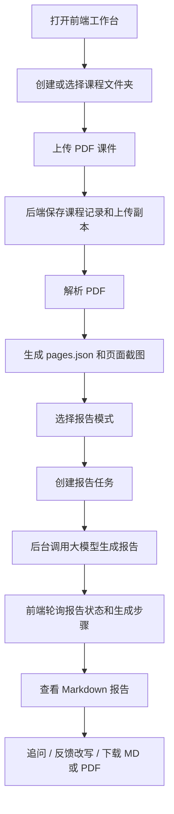
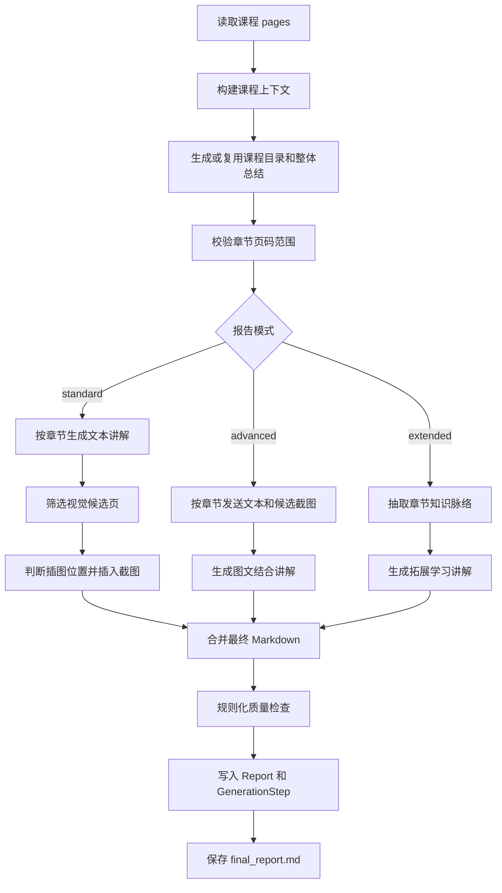

# Course Learning Agent

Course Learning Agent 是一个本地运行的 AI 课件学习助手。它将 PDF 课件解析为页面文本、页面截图和结构化元数据，再调用大模型生成可追踪、可追问、可局部改写的中文学习报告。

项目定位是个人或小团队的本地学习工作台：不包含登录、权限、多租户和云端协作，重点是把“上传课件 -> 解析课件 -> 生成报告 -> 查看过程 -> 追问和改写”的闭环做扎实。

## 功能概览

- PDF 课件上传、课程文件夹管理、课件移动和删除。
- 基于 PyMuPDF 的 PDF 文本抽取、页面截图渲染、页面类型识别和视觉候选页标记。
- 三种报告模式：
  - `standard`：文本章节讲解 + 视觉候选页插图判断。
  - `advanced`：章节文本 + 候选页截图交给多模态模型生成图文讲解。
  - `extended`：先抽取知识脉络，再生成偏学习理解的拓展讲解。
- 报告后台生成、停止生成、进度轮询、版本列表和双报告对比。
- 生成步骤追踪：保存每一步输入预览、输出内容、错误信息和 token 估算。
- Markdown 报告在线渲染，支持公式、表格、图片、下载 Markdown 和导出 PDF。
- 报告追问：支持整份报告、章节、页码、插图范围，区分普通追问和高级追问。
- 反馈改写：对选中内容提交反馈，生成局部改写版本，并可应用回报告。
- 前端模型配置：可为不同用途配置 provider、model、base URL 和 API Key，并做连通性测试。

## 技术栈

| 模块 | 技术 |
| --- | --- |
| 后端 | FastAPI, SQLAlchemy, Pydantic Settings |
| 前端 | React, Vite, TypeScript, Tailwind CSS |
| 数据库 | SQLite |
| PDF 解析 | PyMuPDF |
| 报告格式 | Markdown, react-markdown, KaTeX |
| PDF 导出 | WeasyPrint 优先，PyMuPDF 兜底 |
| 大模型调用 | 自定义 `LLMService`，兼容 OpenAI 风格接口和多 provider 配置 |

## 架构流程

### 用户使用流程



### 报告生成流程



## 项目结构

```text
.
├── backend/
│   ├── app/
│   │   ├── database/        # SQLAlchemy 连接和模型
│   │   ├── prompts/         # 大模型提示词模板
│   │   ├── routers/         # FastAPI API 路由
│   │   ├── services/        # 课程、解析、报告、交互、模型配置等业务逻辑
│   │   ├── utils/           # 文件、Markdown、Prompt 工具
│   │   ├── config.py
│   │   └── main.py
│   ├── scripts/             # 本地验证和调试脚本
│   └── requirements.txt
├── docs/                    # 设计说明和优化计划
├── frontend/
│   ├── src/
│   │   ├── api/             # 前端 API client
│   │   ├── components/      # 工作台组件
│   │   ├── pages/           # 页面级组件
│   │   ├── types/
│   │   ├── App.tsx
│   │   └── styles.css
│   ├── package.json
│   └── vite.config.js
├── samples/                 # 可选本地测试材料，默认不建议提交大文件
├── .env.example
├── .gitignore
└── README.md
```

运行时目录不会进入 Git：

```text
uploads/       # 上传 PDF 副本
storage/       # 页面截图、pages.json、报告文件
*.db           # SQLite 数据库
frontend/dist/ # 前端构建产物
frontend/node_modules/
```

## 环境要求

- Python 3.11 或更高版本。
- Node.js 20 或更高版本。
- Windows 环境推荐使用 PowerShell；项目也可在 macOS/Linux 下手动启动。
- 如果需要高质量 PDF 导出，请安装 WeasyPrint 所需系统依赖；失败时后端会使用 PyMuPDF 基础导出兜底。

## 配置

复制环境变量模板：

```powershell
Copy-Item .env.example .env
```

至少需要关注以下配置：

```env
BACKEND_HOST=127.0.0.1
BACKEND_PORT=8000
UPLOAD_DIR=uploads
STORAGE_DIR=storage
DATABASE_URL=sqlite:///./course_agent.db

STANDARD_TEXT_PROVIDER=deepseek
STANDARD_TEXT_MODEL=DeepSeek-V3.2
VISUAL_VISION_PROVIDER=kimi
VISUAL_VISION_MODEL=Kimi-K2.5
ADVANCED_PROVIDER=kimi
ADVANCED_MODEL=Kimi-K2.5

DEEPSEEK_API_KEY=your_api_key
DEEPSEEK_BASE_URL=https://modelservice.jdcloud.com/coding/openai/v1
KIMI_API_KEY=your_api_key
KIMI_BASE_URL=https://modelservice.jdcloud.com/coding/openai/v1
```

前端默认请求 `http://127.0.0.1:8001`。如果后端端口不同，可以设置：

```powershell
$env:VITE_API_BASE_URL="http://127.0.0.1:8000"
```

## 本地启动

### 后端

```powershell
cd backend
python -m venv .venv
.\.venv\Scripts\Activate.ps1
pip install -r requirements.txt
python -m uvicorn app.main:app --host 127.0.0.1 --port 8001 --reload
```

健康检查：

```text
http://127.0.0.1:8001/api/health
```

### 前端

```powershell
cd frontend
npm install
npm.cmd run dev -- --host 127.0.0.1 --port 5173
```

访问地址：

```text
http://127.0.0.1:5173
```

### Windows 一键启动

首次安装依赖后，也可以在项目根目录双击：

```text
启动课件学习助手.bat
```

该脚本会启动：

- 后端：`http://127.0.0.1:8001`
- 前端：`http://127.0.0.1:5173`

## 核心 API

| 方法 | 路径 | 说明 |
| --- | --- | --- |
| `GET` | `/api/health` | 健康检查 |
| `POST` | `/api/upload` | 上传 PDF，创建课程记录 |
| `GET` | `/api/folders` | 获取课程文件夹 |
| `POST` | `/api/folders` | 创建课程文件夹 |
| `PUT` | `/api/folders/{folder_id}` | 更新课程文件夹 |
| `DELETE` | `/api/folders/{folder_id}` | 删除课程文件夹 |
| `GET` | `/api/courses` | 获取课程列表 |
| `GET` | `/api/courses/{course_id}` | 获取课程详情 |
| `PUT` | `/api/courses/{course_id}/folder` | 移动课程到文件夹 |
| `POST` | `/api/courses/{course_id}/parse` | 解析课程 PDF |
| `GET` | `/api/courses/{course_id}/pages` | 获取页面解析结果 |
| `GET` | `/api/courses/{course_id}/chapters` | 获取章节结构 |
| `GET` | `/api/courses/{course_id}/images/{image_name}` | 获取页面截图 |
| `POST` | `/api/courses/{course_id}/reports` | 创建后台报告任务 |
| `GET` | `/api/courses/{course_id}/reports` | 获取课程报告列表 |
| `GET` | `/api/reports/{report_id}` | 获取报告详情 |
| `POST` | `/api/reports/{report_id}/stop` | 请求停止报告生成 |
| `PUT` | `/api/reports/{report_id}/markdown` | 更新报告 Markdown |
| `GET` | `/api/reports/{report_id}/steps` | 获取生成步骤 |
| `GET` | `/api/reports/{report_id}/download.md` | 下载 Markdown |
| `GET` | `/api/reports/{report_id}/download.pdf` | 下载 PDF |
| `POST` | `/api/reports/{report_id}/chat` | 报告追问 |
| `POST` | `/api/reports/{report_id}/feedback` | 提交反馈改写 |
| `POST` | `/api/feedback/{feedback_id}/apply` | 应用改写结果 |
| `GET` | `/api/settings/model-config` | 获取模型配置 |
| `PUT` | `/api/settings/model-config` | 保存模型配置 |
| `POST` | `/api/settings/model-config/test` | 测试模型配置 |

## 数据模型

核心表：

- `course_folders`：课程文件夹。
- `courses`：课件基础信息、状态、文件路径和解析状态。
- `pages`：每页文本、截图路径、页面类型、视觉候选标记和结构化特征。
- `chapters`：模型生成并校验后的章节范围。
- `reports`：报告模式、状态、Markdown 内容、检查结果和文件路径。
- `generation_steps`：报告生成过程记录。
- `chat_messages`：追问上下文和回答记录。
- `feedback`：局部反馈改写记录。

## 文件存储约定

每个课程在 `storage/` 下有独立目录：

```text
storage/
└── course_001/
    ├── original/
    │   └── course_001_xxx.pdf
    ├── images/
    │   ├── page_001.png
    │   └── page_002.png
    ├── pages.json
    └── reports/
        ├── standard/
        │   └── report_001/
        │       ├── final_report.md
        │       ├── image_insert_plan.json
        │       └── generation_context_cache.json
        ├── advanced/
        └── extended/
```

## 开发验证

后端语法检查：

```powershell
cd backend
python -m compileall app
```

前端构建：

```powershell
cd frontend
npm.cmd run build
```

LLMService 离线配置检查：

```powershell
cd backend
python scripts\test_llm_service.py --provider kimi --model Kimi-K2.5 --skip-network
```

使用本地 PDF 跑报告生成：

```powershell
cd backend
python scripts\run_standard_report_real.py --pdf "..\samples\3.6页目录自映射(20260330).pdf" --mode standard
```

`--mode` 可选值：

```text
standard
advanced
extended
```

## 当前限制

- 目前只支持 PDF，不支持 PPT/PPTX。
- OCR 不是主流程，只通过 `need_ocr` 和 `scanned_like` 标记扫描件倾向。
- 报告质量依赖提示词和所选模型能力。
- 高级模式需要多模态能力，当前 provider/model 可在前端或 `.env` 中调整。
- PDF 导出优先使用 WeasyPrint，复杂分页和版式仍有优化空间。
- 本项目面向本地使用，默认没有身份认证和权限隔离。

